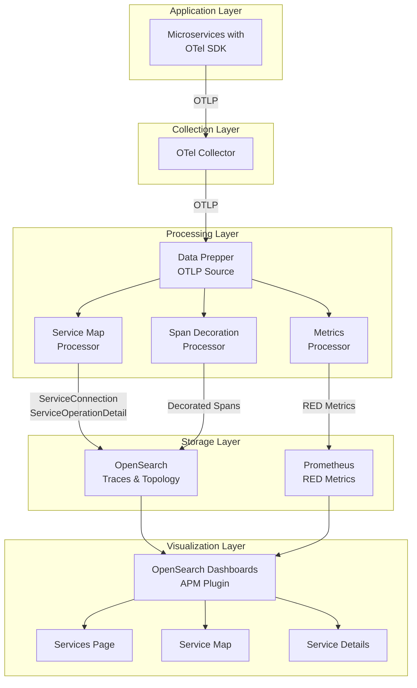
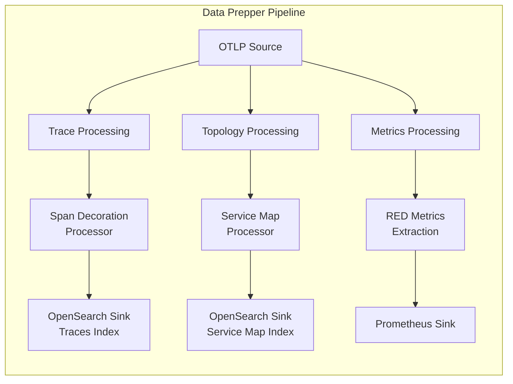
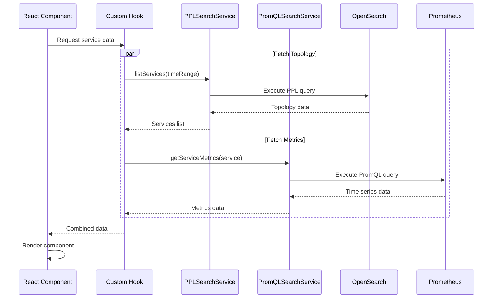
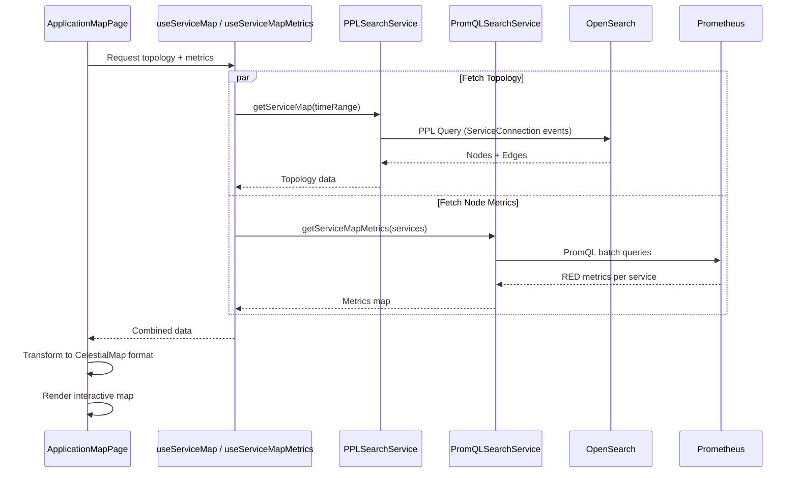

# APM Plugin

> **Note:** This plugin is currently under active development. Features and APIs may change.

## Implementation Status

| Feature | Status | Notes |
|---------|--------|-------|
| Services Home Page | ✅ Complete | Service catalog with RED metrics |
| Service Details - Overview | ✅ Complete | Metric cards, charts, fault widgets |
| Service Details - Operations | ✅ Complete | Operations table with filters |
| Service Details - Dependencies | ✅ Complete | Dependencies table with filters |
| Application Map | ✅ Complete | Interactive topology with CelestialMap |
| APM Settings Modal | ✅ Complete | Configure data sources |
| Service Correlations Flyout | ✅ Complete | Spans and logs correlation |

---

## Overview

The APM (Application Performance Monitoring) plugin for OpenSearch Dashboards provides comprehensive observability capabilities for distributed applications. It enables users to monitor service health, analyze latency patterns, track error rates, and visualize service dependencies.

The plugin implements a hybrid architecture that combines:
- **OpenSearch** for storing trace topology and service metadata
- **Prometheus** for storing time-series RED (Rate, Error, Duration) metrics

---

## End-to-End User Workflow

### Entry Points
Users can access APM features through two main entry points:
1. **Services** (`#/services`) - Service catalog with list view
2. **Application Map** (`#/application-map`) - Topology visualization

### Typical User Journey

1. **Configure APM** (First-time setup)
   - User clicks "APM Settings" button
   - Configures: Traces dataset, Service Map dataset, Prometheus connection
   - Config saved as correlations saved object

2. **Services Home** (`/services`)
   - View list of all services with RED metrics
   - Filter by environment, latency, throughput, fault rate
   - Click service name → Navigate to Service Details
   - Click map icon → Navigate to Application Map focused on service

3. **Service Details** (`/service-details/{serviceName}/{environment}`)
   - **Overview Tab**: Metric cards, trend charts, top dependencies
   - **Operations Tab**: Operations table with expandable metrics
   - **Dependencies Tab**: Dependencies table with RED metrics
   - Click dependency count → Navigate to Dependencies tab with filter

4. **Application Map** (`/application-map`)
   - View topology of all services
   - Apply Group By filter to cluster services
   - Click node → View service details flyout
   - Click edge → View dependency metrics flyout
   - Double-click group node → Drill into services in group

---

## System Architecture

### High-Level Overview



### Component Breakdown

| Layer | Component | Purpose | Technology |
|-------|-----------|---------|------------|
| **Application** | Microservices | Instrumented applications | OTel SDK (Java, Python, Go, etc.) |
| **Collection** | OTel Collector | Collect and forward telemetry | OpenTelemetry Collector |
| **Processing** | Data Prepper | Process and route telemetry | OpenSearch Data Prepper |
| | Service Map Processor | Extract topology | Data Prepper Processor |
| | Span Decoration | Enrich spans | Data Prepper Processor |
| | Metrics Processor | Generate RED metrics | Data Prepper Processor |
| **Storage** | OpenSearch | Store traces/topology | OpenSearch |
| | Prometheus | Store metrics | Prometheus TSDB |
| **Visualization** | Dashboards Plugin | APM UI | OpenSearch Dashboards |

---

## Data Ingestion Pipeline

### Data Prepper Components

Data Prepper acts as the central processing hub, transforming raw OpenTelemetry data into formats optimized for storage and querying.



#### Service Map Processor

Extracts service topology and relationship data from distributed traces.

**Event Types Generated:**

1. **ServiceConnection** - Service-to-service communication
2. **ServiceOperationDetail** - Operation-level details

**Example ServiceConnection Event:**
```json
{
  "hashCode": "6239b20a9cf210190e9e9ecec22953abaf04989224ce3870fd46de3353e1f220",
  "timestamp": 1765405560,
  "eventType": "ServiceConnection",
  "service": {
    "keyAttributes": {
      "environment": "eks:demo/default",
      "name": "frontend-service",
      "type": "Service"
    },
    "groupByAttributes": {
      "team": "platform",
      "businessUnit": "retail"
    }
  },
  "remoteService": {
    "keyAttributes": {
      "environment": "eks:demo/default",
      "name": "backend-service",
      "type": "Service"
    }
  }
}
```

#### Prometheus Sink (RED Metrics)

Exports aggregated RED metrics to Prometheus.

| Metric Name | Type | Description |
|-------------|------|-------------|
| `request` | Gauge | Total request count |
| `error` | Gauge | 4xx error count |
| `fault` | Gauge | 5xx fault count |
| `latency_seconds_seconds_bucket` | Histogram | Latency distribution |

**Labels:** `service`, `environment`, `operation`, `remoteService`, `namespace`

#### Example Pipeline Configuration

```yaml
pipelines:
  otlp-traces:
    source:
      otlp:
        traces_path: /v1/traces
        traces_output_format: otel
    sink:
      - pipeline:
          name: "trace_processing"
      - pipeline:
          name: "topology_processing"
      - pipeline:
          name: "metrics_processing"

  topology_processing:
    source:
      pipeline:
        name: "otlp-traces"
    processor:
      - otel_apm_service_map:
          window_duration: 60
          groupByAttributes:
            - team
            - businessUnit
    sink:
      - opensearch:
          index: "otel-apm-service-map"

  metrics_processing:
    source:
      pipeline:
        name: "otlp-traces"
    processor:
      - otel_apm_metrics:
          # Extract RED metrics
    sink:
      - prometheus:
          endpoint: "http://prometheus:9090/api/v1/write"
```

---

## Storage Layer

### OpenSearch Schema

**Index Name:** `otel-apm-service-map`

The plugin queries this index using PPL (Piped Processing Language) to fetch service topology data.

**Key Fields:**
- `hashCode` - Unique event identifier for deduplication
- `timestamp` - Event timestamp (epoch seconds)
- `eventType` - `ServiceConnection` or `ServiceOperationDetail`
- `service.keyAttributes` - Service name, environment, type
- `service.groupByAttributes` - Custom attributes (team, businessUnit, etc.)
- `operation.name` - Operation/endpoint name
- `remoteService.keyAttributes` - Dependency service details

### Prometheus Metrics

RED metrics are stored in Prometheus and queried via PromQL.

**Example Metrics:**
```
request{service="frontend",environment="production",operation="GET /api/users"} 15420
fault{service="frontend",environment="production",operation="GET /api/users"} 23
latency_seconds_seconds_bucket{service="frontend",environment="production",le="0.01"} 5400
```

---

## Query Services

### PPL Search Service

Located at: `query_services/ppl_search_service.ts`

Executes PPL queries against OpenSearch for topology data.

**Available Queries:**

| Method | Purpose |
|--------|---------|
| `listServices()` | List all services in a time range |
| `getService()` | Get details for a specific service |
| `listServiceOperations()` | List operations for a service |
| `listServiceDependencies()` | List dependencies for a service |
| `getServiceMap()` | Get full service map topology |

**Example PPL Query - List Services:**
```sql
source=otel-apm-service-map
| where timestamp >= 1765405560 and timestamp <= 1765405860
| dedup hashCode
| where eventType = 'ServiceOperationDetail'
| fields service.keyAttributes, service.groupByAttributes
```

### PromQL Search Service

Located at: `query_services/promql_search_service.ts`

Executes PromQL queries against Prometheus for RED metrics.

**Available Queries:**

| Query Type | Purpose |
|------------|---------|
| Service Request Rate | `sum(request{environment="...",service="..."})` |
| Service Error Rate | `sum(error{...}) / sum(request{...})` |
| P95 Latency | `histogram_quantile(0.95, latency_seconds_seconds_bucket{...})` |
| Top Operations by Fault | `topk(5, sum by (operation) (fault{...}))` |
| Top Services by Fault Rate | Aggregate fault rates across services |
| Top Dependencies by Fault Rate | Aggregate dependency fault rates |

**Service Details Queries:**

| Query Type | Purpose |
|------------|---------|
| Service Requests (card) | Total requests for a service |
| Service Faults (card) | Total 5xx faults for a service |
| Service Errors (card) | Total 4xx errors for a service |
| Service Availability (card) | `1 - (faults / requests)` |
| Latency P99 (card) | 99th percentile latency |
| Latency by Dependencies (chart) | P95 latency grouped by dependency |
| Requests by Operations (chart) | Request rate grouped by operation |
| Availability by Operations (chart) | Availability grouped by operation |
| Fault Rate by Operations (chart) | Fault rate grouped by operation |
| Error Rate by Operations (chart) | Error rate grouped by operation |
| Operation Metrics (table) | Latency, requests, errors, availability per operation |
| Dependency Metrics (table) | Latency, requests, errors, availability per dependency |

**Query Best Practices:**

The PromQL queries implement several SRE best practices:

| Practice | Implementation |
|----------|----------------|
| Division-by-zero protection | Use `clamp_min(denominator, 1)` to avoid NaN/Inf |
| Percentage conversion | Multiply rate ratios by 100 (e.g., `fault/request * 100`) |
| Fallback aggregation | Use `or label_replace(...)` pattern for "overall" metrics |
| Top/Bottom K selection | Use `topk()` and `bottomk()` for ranking operations |

**Example - Safe Fault Rate Calculation:**
```promql
topk(5,
  sum by (operation) (fault{service="...",namespace="span_derived"})
  /
  clamp_min(sum by (operation) (request{service="...",namespace="span_derived"}), 1)
  * 100
)
```

---

## UI Components

### Implemented

#### Services Home Page (`pages/services_home/`)
- Interactive services table with columns:
  - Service Name (with language icon)
  - Environment
  - Latency (P95) with sparkline
  - Throughput with sparkline
  - Failure Ratio with sparkline
  - Actions (View Map, Logs, Traces)
- Resizable filter sidebar:
  - Environment filter
  - Latency range filter
  - Throughput range filter
  - Failure ratio threshold filter
  - Dynamic attribute filters
- Search functionality
- Time range picker

#### APM Settings Modal (`config/apm_settings_modal.tsx`)
- Configure Traces dataset
- Configure Service Map dataset
- Configure Prometheus data source
- Correlated logs configuration

#### Fault Rate Widgets (`shared/components/fault_widgets/`)
- Top Services by Fault Rate
- Top Dependencies by Fault Rate
- Service Dependencies by Fault Rate (for service details)

#### Service Details Page (`pages/service_details/`)

Multi-tab interface for exploring a specific service's performance metrics.

**URL Schema:**
```
#/service-details/{serviceName}/{environment}?tab={overview|operations|dependencies}&operation={op}&dependency={dep}
```

**Tabs:**

| Tab | Component | Features |
|-----|-----------|----------|
| Overview | `service_overview.tsx` | Metric cards (Requests, Faults, Errors, Availability, P99 Latency), Service metadata panel, Top Dependencies by Fault Rate widget, Time-series charts with technical helper tooltips and configurable Top K/Bottom K selectors (Latency by Dependencies with P99/P90/P50 selector, Requests by Operations, Availability by Operations, Fault/Error Rate by Operations) |
| Operations | `service_operations.tsx` | Operations table with expandable rows showing charts, Resizable filter sidebar (availability, error rate, latency, requests ranges), Metrics per operation, Click dependency count to navigate to Dependencies tab with filter |
| Dependencies | `service_dependencies.tsx` | Dependencies table with expandable rows showing charts, Resizable filter sidebar (dependency, operation, availability, error rate), Metrics per dependency (latency, requests, error rate, availability), URL param support for filter pre-selection |

#### Application Map Page (`pages/application_map/`)
- Interactive service topology visualization using @osd/apm-topology CelestialMap
- Hierarchical navigation (Application → Group → Services)
- Features:
  - Node representation for each service with health indicators
  - Edge representation for service dependencies
  - Click node to view service details flyout
  - Click edge to view dependency metrics flyout
  - Filter sidebar: Group By, Fault Rate, Error Rate, Environment
  - Deep-linking support from Services Home
  - URL params: `?service={name}&environment={env}&from={time}&to={time}`

#### Service Map Components (`shared/components/service_map/`)
- `ServiceMapGraph` - CelestialMap wrapper with data transformation
- `ServiceMapSidebar` - Filter controls for the map
- `ServiceDetailsPanel` - Flyout showing selected node metrics
- `EdgeMetricsFlyout` - Flyout showing edge/dependency metrics

#### PromQL Visualization Components (`shared/components/`)
- **PromQL Line Chart** (`promql_line_chart.tsx`) - Time-series charts using PromQL data with multi-series support
  - Uses ECharts native `showLoading()` API for centered loading animation
  - Supports `line` and `area` chart types
  - Interactive tooltips with timestamp and all series values
  - Configurable legend, value formatting, and label field extraction
- **PromQL Metric Card** (`promql_metric_card.tsx`) - Single metric display cards
  - Background sparkline chart with trend visualization
  - Trend indicator (up/down arrows with percentage change)
  - Supports color inversion for metrics where increase is bad (e.g., error rates)
  - Uses EuiLoadingChart for loading state

#### Filter Sidebars (`shared/components/`)
- **Operation Filter Sidebar** (`operation_filter_sidebar.tsx`) - Filters for Operations tab
- **Dependency Filter Sidebar** (`dependency_filter_sidebar.tsx`) - Filters for Dependencies tab

---

## Configuration

### APM Settings

The plugin stores configuration as OpenSearch Dashboards saved objects.

**Configuration Fields:**
| Setting | Description |
|---------|-------------|
| Traces Dataset | OpenSearch dataset for trace data |
| Service Map Dataset | OpenSearch dataset for topology data |
| Prometheus Data Source | Prometheus connection for RED metrics |

### Feature Flag

**Setting:** `observability:apmEnabled`

Controls whether the APM view is enabled in the navigation.

---

## Folder Structure

```
public/components/apm/
├── README.md                      # This file
├── services.tsx                   # Main Services entry point (routes)
├── application_map.tsx            # Application Map entry point
│
├── config/                        # Configuration components
│   ├── apm_config_context.tsx     # React context for config
│   ├── apm_settings_modal.tsx     # Settings modal component
│   └── hooks.ts                   # Config-related hooks
│
├── pages/                         # Page implementations
│   ├── services_home/             # Services home page
│   │   ├── index.ts
│   │   ├── services_home.tsx      # Main services component
│   │   └── services_home_i18n.ts  # i18n translations
│   ├── service_details/           # Service details page
│   │   ├── index.ts
│   │   ├── service_details.tsx    # Main container with tabs
│   │   ├── service_overview.tsx   # Overview tab
│   │   ├── service_overview.scss
│   │   ├── service_operations.tsx # Operations tab
│   │   └── service_dependencies.tsx # Dependencies tab
│   └── application_map/           # Application map page
│       ├── index.ts
│       ├── application_map_page.tsx
│       ├── application_map.scss
│       └── application_map_i18n.ts
│
├── query_services/                # Query execution services
│   ├── ppl_search_service.ts      # PPL query service
│   ├── promql_search_service.ts   # PromQL query service
│   └── query_requests/            # Query builders
│       ├── ppl_queries.ts         # PPL query templates
│       ├── promql_queries.ts      # PromQL query templates
│       └── response_processor.ts  # Response transformation
│
├── shared/                        # Shared components & utilities
│   ├── components/                # Reusable UI components
│   │   ├── apm_page_header.tsx
│   │   ├── empty_state.tsx
│   │   ├── language_icon.tsx
│   │   ├── metric_sparkline.tsx
│   │   ├── promql_line_chart.tsx  # PromQL time-series chart
│   │   ├── promql_metric_card.tsx # PromQL metric card
│   │   ├── operation_filter_sidebar.tsx  # Operations filter
│   │   ├── dependency_filter_sidebar.tsx # Dependencies filter
│   │   ├── service_correlations_flyout.tsx
│   │   ├── filters/               # Filter components
│   │   │   ├── latency_range_filter.tsx
│   │   │   ├── throughput_range_filter.tsx
│   │   │   └── failure_rate_threshold_filter.tsx
│   │   ├── fault_widgets/         # Fault rate widgets
│   │   │   ├── top_services_by_fault_rate.tsx
│   │   │   ├── top_dependencies_by_fault_rate.tsx
│   │   │   └── service_dependencies_by_fault_rate.tsx
│   │   ├── time_filter/           # Time picker
│   │   └── service_map/           # Service map components
│   │       ├── index.ts
│   │       ├── service_map_graph.tsx
│   │       ├── service_map_sidebar.tsx
│   │       ├── service_details_panel.tsx
│   │       └── edge_metrics_flyout.tsx
│   ├── hooks/                     # Custom React hooks
│   │   ├── use_apm_config.ts      # Access APM configuration
│   │   ├── use_services.ts        # Fetch service list via PPL
│   │   ├── use_services_red_metrics.ts # Batch RED metrics for services
│   │   ├── use_top_services_by_fault_rate.ts
│   │   ├── use_top_dependencies_by_fault_rate.ts
│   │   ├── use_operations.ts      # Fetch operations via PPL
│   │   ├── use_operation_metrics.ts # RED metrics per operation
│   │   ├── use_dependencies.ts    # Fetch dependencies via PPL
│   │   ├── use_dependency_metrics.ts # RED metrics per dependency
│   │   ├── use_service_attributes.ts # Service metadata
│   │   ├── use_promql_chart_data.ts # Generic PromQL chart hook
│   │   ├── use_service_dependencies_by_fault_rate.ts
│   │   ├── use_correlated_logs_by_trace.ts
│   │   ├── use_debounced_value.ts
│   │   ├── use_service_map.ts     # Fetch service map topology via PPL
│   │   ├── use_service_map_metrics.ts # RED metrics for map nodes
│   │   ├── use_edge_metrics.ts    # Metrics for service dependencies
│   │   ├── use_selected_edge_metrics.ts # On-demand edge metrics
│   │   └── use_group_metrics.ts   # Metrics aggregated by groupBy
│   ├── styles/                    # Shared SCSS styles
│   └── utils/                     # Utility functions
│       ├── navigation_utils.ts    # Workspace-aware navigation
│       ├── time_utils.ts
│       ├── format_utils.ts
│       └── promql_response_utils.ts
│
├── common/                        # Common types & utilities
│   ├── constants.ts
│   ├── format_utils.ts            # Formatting (count, %, latency)
│   ├── apm_empty_state.tsx
│   ├── apm_empty_state_i18n.ts
│   └── types/
│       ├── apm_types.ts
│       ├── service_types.ts
│       ├── service_details_types.ts
│       ├── prometheus_types.ts
│       ├── correlations_types.ts
│       └── service_map_types.ts
```

---

## Navigation

### Workspace-Aware Navigation

The plugin uses `application.navigateToApp()` for navigation to comply with OpenSearch Dashboards workspace guidelines.

**Location:** `shared/utils/navigation_utils.ts`

**Available Functions:**

| Function | Purpose |
|----------|---------|
| `navigateToServiceDetails(serviceName, environment, options)` | Navigate to service details page with optional tab, filters |
| `navigateToServicesList()` | Navigate back to services home |
| `navigateToServiceMap(serviceName?, environment?, options?)` | Navigate to Application Map, optionally focused on a service |
| `navigateToExploreTraces(...)` | Open traces in Explore (new tab) |
| `navigateToExploreLogs(...)` | Open logs in Explore (new tab) |
| `navigateToSpanDetails(...)` | Open span details in Explore (new tab) |
| `navigateToDatasetCorrelations(datasetId)` | Navigate to dataset correlations setup |

**URL Parameters for Service Details:**

| Parameter | Description |
|-----------|-------------|
| `tab` | Active tab: `overview`, `operations`, `dependencies` |
| `operation` | Pre-select operation in Dependencies filter sidebar |
| `dependency` | Pre-select dependency in Dependencies filter sidebar |
| `from`, `to` | Time range |
| `lang` | SDK language for breadcrumb icon |

**URL Parameters for Application Map:**

| Parameter | Description |
|-----------|-------------|
| `service` | Focus on a specific service node |
| `environment` | Filter by environment |
| `from`, `to` | Time range |
| `focus` | Highlight a specific service |

**Example:**
```typescript
import { navigateToServiceDetails, navigateToServiceMap } from './shared/utils/navigation_utils';

// Navigate to dependencies tab with operation filter
navigateToServiceDetails('my-service', 'production', {
  tab: 'dependencies',
  operation: 'GET /api/users',
});

// Navigate to Application Map focused on a service
navigateToServiceMap('my-service', 'production', {
  timeRange: { from: 'now-1h', to: 'now' },
});
```

---

## Hooks Reference

### Services & Metrics Hooks

| Hook | Purpose |
|------|---------|
| `useApmConfig` | Access APM configuration from context |
| `useServices` | Fetch service list via PPL from service map dataset |
| `useServicesRedMetrics` | Batch fetch RED metrics for multiple services via PromQL |
| `useTopServicesByFaultRate` | Get services sorted by fault rate |
| `useTopDependenciesByFaultRate` | Get dependencies sorted by fault rate |

### Service Details Hooks

| Hook | Purpose |
|------|---------|
| `useOperations` | Fetch operations for a service via PPL |
| `useOperationMetrics` | RED metrics per operation via PromQL |
| `useDependencies` | Fetch dependencies for a service via PPL |
| `useDependencyMetrics` | RED metrics per dependency via PromQL |
| `useServiceAttributes` | Fetch service metadata (language, type, etc.) |
| `useServiceDependenciesByFaultRate` | Dependencies ranked by fault rate |
| `usePromqlChartData` | Generic hook for PromQL time-series data |

### Service Map Hooks

| Hook | Purpose |
|------|---------|
| `useServiceMap` | Fetch service map topology (nodes/edges) via PPL |
| `useServiceMapMetrics` | Fetch RED metrics for all map nodes via PromQL |
| `useEdgeMetrics` | Fetch metrics for service dependencies (edges) |
| `useSelectedEdgeMetrics` | On-demand metrics for selected edge |
| `useGroupMetrics` | Metrics aggregated by groupBy attribute |

### Utility Hooks

| Hook | Purpose |
|------|---------|
| `useCorrelatedLogsByTrace` | Fetch correlated log datasets for traces |
| `useDebouncedValue` | Debounce rapidly changing values |

---

## Development

### Running Tests

```bash
# Run all APM tests
yarn test --testPathPattern=public/components/apm

# Run specific test file
yarn test -- public/components/apm/shared/hooks/__tests__/use_services.test.ts
```

### Linting

```bash
yarn lint:es public/components/apm
```

### i18n Pattern

All user-facing text uses `@osd/i18n`:

```typescript
import { i18n } from '@osd/i18n';

const label = i18n.translate('observability.apm.services.columnName', {
  defaultMessage: 'Service Name',
});
```

For files with many translations, extract to a separate `*_i18n.ts` file.

---

## Data Flow Diagrams

### Services Home Data Flow



### Application Map Data Flow



---

## Future Improvements (TODOs)

The following improvements are planned for the Operations and Dependencies pages:

### Quick Actions Column
Add a "Quick Actions" column to Operations and Dependencies tables with links to:
- **View Traces** - Filter traces by operation/dependency
- **View Logs** - Filter logs by operation/dependency

This would enable users to quickly drill down into specific operations or dependencies for troubleshooting.

### Comparison to Previous Period
Add the ability to compare current metrics with a previous time period:
- Show delta from previous time range (e.g., "↑ 2.3% from last hour")
- Visual indicators for metrics trending up/down
- Configurable comparison period

This would help users identify trends and regressions quickly.

---

## Related Documentation

- [Application Performance Monitorign RFC](https://github.com/opensearch-project/dashboards-observability/issues/2545)
