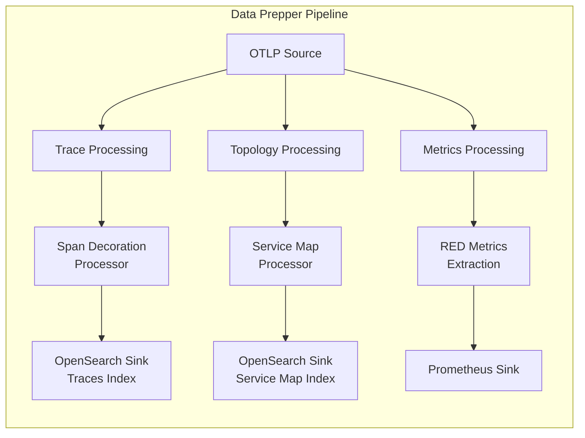
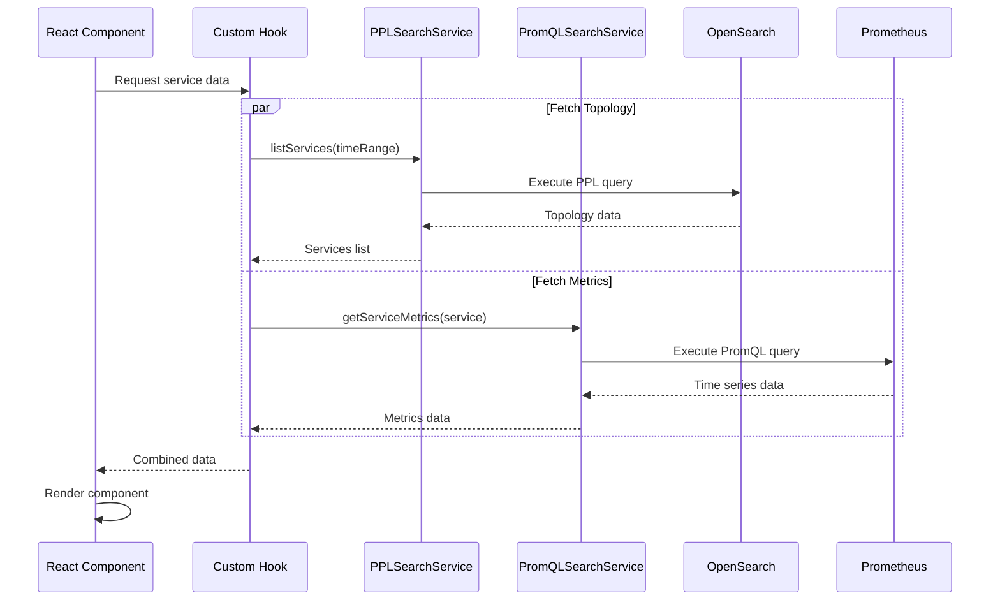

# APM Plugin

> **Note:** This plugin is currently under active development. Features and APIs may change.

## Overview

The APM (Application Performance Monitoring) plugin for OpenSearch Dashboards provides comprehensive observability capabilities for distributed applications. It enables users to monitor service health, analyze latency patterns, track error rates, and visualize service dependencies.

The plugin implements a hybrid architecture that combines:
- **OpenSearch** for storing trace topology and service metadata
- **Prometheus** for storing time-series RED (Rate, Error, Duration) metrics

---

## System Architecture

### High-Level Overview

```mermaid
graph TB
    subgraph "Application Layer"
        A[Microservices with<br/>OTel SDK]
    end

    subgraph "Collection Layer"
        B[OTel Collector]
    end

    subgraph "Processing Layer"
        C[Data Prepper<br/>OTLP Source]
        D[Service Map<br/>Processor]
        E[Span Decoration<br/>Processor]
        F[Metrics<br/>Processor]
    end

    subgraph "Storage Layer"
        G[OpenSearch<br/>Traces & Topology]
        H[Prometheus<br/>RED Metrics]
    end

    subgraph "Visualization Layer"
        I[OpenSearch Dashboards<br/>APM Plugin]
        J[Services Page]
        K[Service Map]
        L[Service Details]
    end

    A -->|OTLP| B
    B -->|OTLP| C
    C --> D
    C --> E
    C --> F
    D -->|ServiceConnection<br/>ServiceOperationDetail| G
    E -->|Decorated Spans| G
    F -->|RED Metrics| H
    G --> I
    H --> I
    I --> J
    I --> K
    I --> L
```



### Component Breakdown

| Layer | Component | Purpose | Technology |
|-------|-----------|---------|------------|
| **Application** | Microservices | Instrumented applications | OTel SDK (Java, Python, Go, etc.) |
| **Collection** | OTel Collector | Collect and forward telemetry | OpenTelemetry Collector |
| **Processing** | Data Prepper | Process and route telemetry | OpenSearch Data Prepper |
| | Service Map Processor | Extract topology | Data Prepper Processor |
| | Span Decoration | Enrich spans | Data Prepper Processor |
| | Metrics Processor | Generate RED metrics | Data Prepper Processor |
| **Storage** | OpenSearch | Store traces/topology | OpenSearch |
| | Prometheus | Store metrics | Prometheus TSDB |
| **Visualization** | Dashboards Plugin | APM UI | OpenSearch Dashboards |

---

## Data Ingestion Pipeline

### Data Prepper Components

Data Prepper acts as the central processing hub, transforming raw OpenTelemetry data into formats optimized for storage and querying.



#### Service Map Processor

Extracts service topology and relationship data from distributed traces.

**Event Types Generated:**

1. **ServiceConnection** - Service-to-service communication
2. **ServiceOperationDetail** - Operation-level details

**Example ServiceConnection Event:**
```json
{
  "hashCode": "6239b20a9cf210190e9e9ecec22953abaf04989224ce3870fd46de3353e1f220",
  "timestamp": 1765405560,
  "eventType": "ServiceConnection",
  "service": {
    "keyAttributes": {
      "environment": "eks:demo/default",
      "name": "frontend-service",
      "type": "Service"
    },
    "groupByAttributes": {
      "team": "platform",
      "businessUnit": "retail"
    }
  },
  "remoteService": {
    "keyAttributes": {
      "environment": "eks:demo/default",
      "name": "backend-service",
      "type": "Service"
    }
  }
}
```

#### Prometheus Sink (RED Metrics)

Exports aggregated RED metrics to Prometheus.

| Metric Name | Type | Description |
|-------------|------|-------------|
| `request` | Gauge | Total request count |
| `error` | Gauge | 4xx error count |
| `fault` | Gauge | 5xx fault count |
| `latency_seconds_seconds_bucket` | Histogram | Latency distribution |

**Labels:** `service`, `environment`, `operation`, `remoteService`, `namespace`

#### Example Pipeline Configuration

```yaml
pipelines:
  otlp-traces:
    source:
      otlp:
        traces_path: /v1/traces
        traces_output_format: otel
    sink:
      - pipeline:
          name: "trace_processing"
      - pipeline:
          name: "topology_processing"
      - pipeline:
          name: "metrics_processing"

  topology_processing:
    source:
      pipeline:
        name: "otlp-traces"
    processor:
      - otel_apm_service_map:
          window_duration: 60
          groupByAttributes:
            - team
            - businessUnit
    sink:
      - opensearch:
          index: "otel-apm-service-map"

  metrics_processing:
    source:
      pipeline:
        name: "otlp-traces"
    processor:
      - otel_apm_metrics:
          # Extract RED metrics
    sink:
      - prometheus:
          endpoint: "http://prometheus:9090/api/v1/write"
```

---

## Storage Layer

### OpenSearch Schema

**Index Name:** `otel-apm-service-map`

The plugin queries this index using PPL (Piped Processing Language) to fetch service topology data.

**Key Fields:**
- `hashCode` - Unique event identifier for deduplication
- `timestamp` - Event timestamp (epoch seconds)
- `eventType` - `ServiceConnection` or `ServiceOperationDetail`
- `service.keyAttributes` - Service name, environment, type
- `service.groupByAttributes` - Custom attributes (team, businessUnit, etc.)
- `operation.name` - Operation/endpoint name
- `remoteService.keyAttributes` - Dependency service details

### Prometheus Metrics

RED metrics are stored in Prometheus and queried via PromQL.

**Example Metrics:**
```
request{service="frontend",environment="production",operation="GET /api/users"} 15420
fault{service="frontend",environment="production",operation="GET /api/users"} 23
latency_seconds_seconds_bucket{service="frontend",environment="production",le="0.01"} 5400
```

---

## Query Services

### PPL Search Service

Located at: `query_services/ppl_search_service.ts`

Executes PPL queries against OpenSearch for topology data.

**Available Queries:**

| Method | Purpose |
|--------|---------|
| `listServices()` | List all services in a time range |
| `getService()` | Get details for a specific service |
| `listServiceOperations()` | List operations for a service |
| `listServiceDependencies()` | List dependencies for a service |
| `getServiceMap()` | Get full service map topology |

**Example PPL Query - List Services:**
```sql
source=otel-apm-service-map
| where timestamp >= 1765405560 and timestamp <= 1765405860
| dedup hashCode
| where eventType = 'ServiceOperationDetail'
| fields service.keyAttributes, service.groupByAttributes
```

### PromQL Search Service

Located at: `query_services/promql_search_service.ts`

Executes PromQL queries against Prometheus for RED metrics.

**Available Queries:**

| Query Type | Purpose |
|------------|---------|
| Service Request Rate | `sum(request{environment="...",service="..."})` |
| Service Error Rate | `sum(error{...}) / sum(request{...})` |
| P95 Latency | `histogram_quantile(0.95, latency_seconds_seconds_bucket{...})` |
| Top Operations by Fault | `topk(5, sum by (operation) (fault{...}))` |
| Top Services by Fault Rate | Aggregate fault rates across services |
| Top Dependencies by Fault Rate | Aggregate dependency fault rates |

---

## UI Components

### Implemented

#### Services Home Page (`pages/services_home/`)
- Interactive services table with columns:
  - Service Name (with language icon)
  - Environment
  - Latency (P95) with sparkline
  - Throughput with sparkline
  - Failure Ratio with sparkline
  - Actions (View Map, Logs, Traces)
- Resizable filter sidebar:
  - Environment filter
  - Latency range filter
  - Throughput range filter
  - Failure ratio threshold filter
  - Dynamic attribute filters
- Search functionality
- Time range picker

#### APM Settings Modal (`config/apm_settings_modal.tsx`)
- Configure Traces dataset
- Configure Service Map dataset
- Configure Prometheus data source
- Correlated logs configuration

#### Fault Rate Widgets (`shared/components/fault_widgets/`)
- Top Services by Fault Rate
- Top Dependencies by Fault Rate

### Planned (In Development)

#### Service Details Page
- Overview tab with RED metrics cards
- Operations tab with metrics per endpoint
- Dependencies tab with upstream/downstream services

#### Application Map
- Interactive service topology visualization
- Node representation for each service
- Edge representation for dependencies

---

## Configuration

### APM Settings

The plugin stores configuration as OpenSearch Dashboards saved objects.

**Configuration Fields:**
| Setting | Description |
|---------|-------------|
| Traces Dataset | OpenSearch dataset for trace data |
| Service Map Dataset | OpenSearch dataset for topology data |
| Prometheus Data Source | Prometheus connection for RED metrics |

### Feature Flag

**Setting:** `observability:apmEnabled`

Controls whether the APM view is enabled in the navigation.

---

## Folder Structure

```
public/components/apm/
├── README.md                      # This file
├── services_home.tsx              # Main Services entry point
├── application_map.tsx            # Application Map entry point
│
├── config/                        # Configuration components
│   ├── apm_config_context.tsx     # React context for config
│   ├── apm_settings_modal.tsx     # Settings modal component
│   └── hooks.ts                   # Config-related hooks
│
├── pages/                         # Page implementations
│   └── services_home/             # Services home page
│       ├── index.ts
│       ├── services.tsx           # Main services component
│       └── services_i18n.ts       # i18n translations
│
├── query_services/                # Query execution services
│   ├── ppl_search_service.ts      # PPL query service
│   ├── promql_search_service.ts   # PromQL query service
│   └── query_requests/            # Query builders
│       ├── ppl_queries.ts         # PPL query templates
│       ├── promql_queries.ts      # PromQL query templates
│       └── response_processor.ts  # Response transformation
│
├── shared/                        # Shared components & utilities
│   ├── components/                # Reusable UI components
│   │   ├── apm_page_header.tsx
│   │   ├── empty_state.tsx
│   │   ├── filter_sidebar.tsx
│   │   ├── language_icon.tsx
│   │   ├── metric_sparkline.tsx
│   │   ├── filters/               # Filter components
│   │   ├── fault_widgets/         # Fault rate widgets
│   │   └── time_filter/           # Time picker
│   ├── hooks/                     # Custom React hooks
│   │   ├── use_services.ts
│   │   ├── use_services_red_metrics.ts
│   │   ├── use_top_services_by_fault_rate.ts
│   │   └── use_top_dependencies_by_fault_rate.ts
│   └── utils/                     # Utility functions
│       ├── constants.ts
│       ├── navigation_utils.ts
│       └── time_utils.ts
│
├── common/                        # Common components
│   ├── apm_empty_state.tsx
│   └── apm_empty_state_i18n.ts
│
└── types/                         # TypeScript definitions
    ├── apm_types.ts
    ├── prometheus_types.ts
    └── service_types.ts
```

---

## Development

### Running Tests

```bash
# Run all APM tests
yarn test --testPathPattern=public/components/apm

# Run specific test file
yarn test -- public/components/apm/shared/hooks/__tests__/use_services.test.ts
```

### Linting

```bash
yarn lint:es public/components/apm
```

### i18n Pattern

All user-facing text uses `@osd/i18n`:

```typescript
import { i18n } from '@osd/i18n';

const label = i18n.translate('observability.apm.services.columnName', {
  defaultMessage: 'Service Name',
});
```

For files with many translations, extract to a separate `*_i18n.ts` file.

---

## Data Flow Diagram



---

## Related Documentation

- [Application Performance Monitorign RFC](https://github.com/opensearch-project/dashboards-observability/issues/2545)
