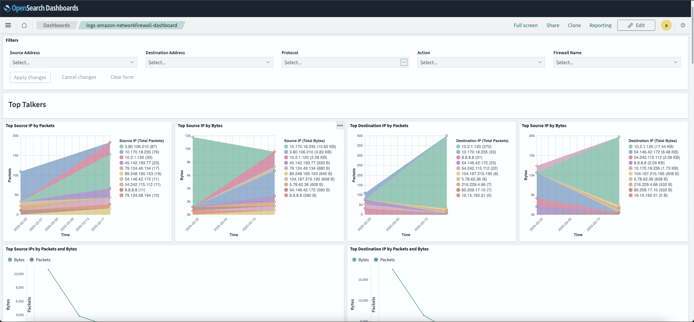
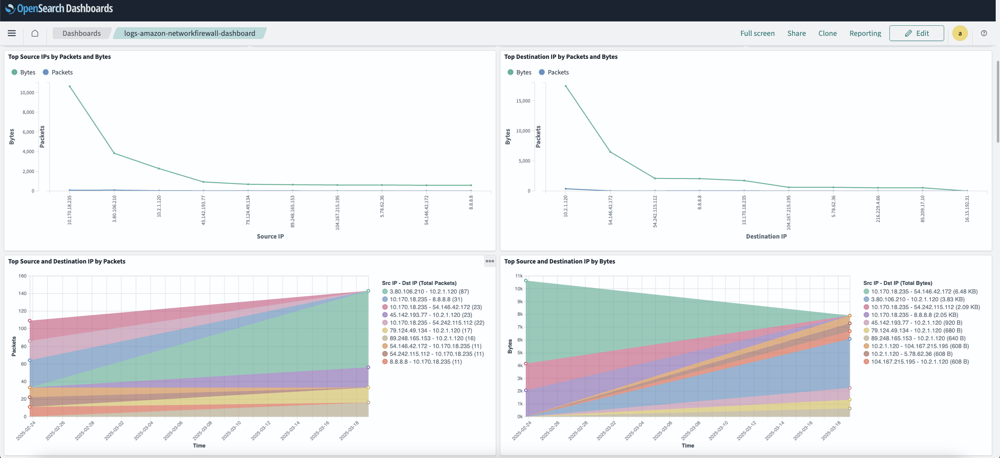
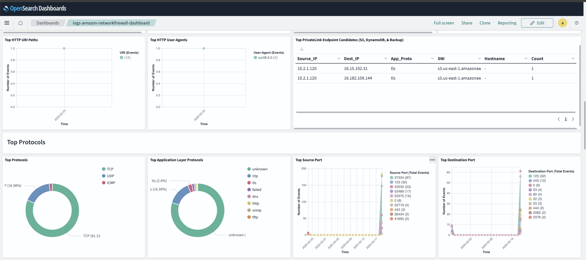
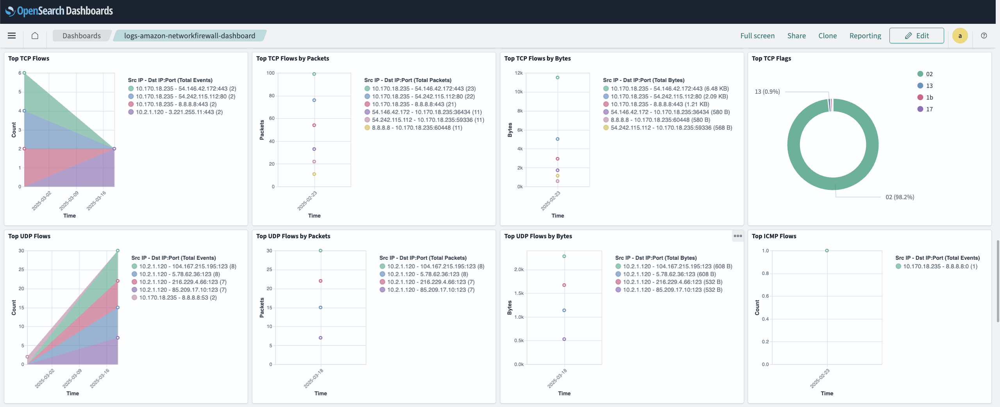

# AWS Network Firewall Integration

## What is AWS Network Firewall?

AWS Network Firewall is a managed network security service that helps protect your AWS Virtual Private Cloud (VPC) resources from network threats.

AWS Network Firewall can be used for various purposes, such as:

1) Network Traffic Filtering:
- Filters incoming and outgoing VPC traffic
- Protects traffic going to and from internet gateways, NAT gateways, VPN connections, and AWS Direct Connect
- Supports both IPv4 and IPv6 traffic

2) Security Controls:
- Creates and enforces customized network security rules
- Provides stateful inspection of network traffic
- Performs deep packet inspection to examine packet contents
- Filters traffic based on IP addresses, ports, and protocols

3) Threat Prevention:
- Blocks known malicious domains
- Prevents unauthorized access to your VPC resources
- Protects against common network threats
- Integrates with AWS WAF for additional web application protection

4) Traffic Management Components:
- Rule Groups: Collections of rules for traffic inspection
- Firewall Policies: Define sets of rules and behavior settings
- Firewalls: Connect rules to your VPC and manage traffic filtering

5) Monitoring and Logging:
- Monitors network traffic in real-time
- Provides logging capabilities for traffic analysis
- Enables tracking of rule matches and traffic patterns

For more details, please see the following:

-> [What is AWS Network Firewall?](docs.aws.amazon.comnetwork-firewalllatestwhat-is-aws-network-firewall.html)

-> [Firewall behavior in AWS Network Firewall](docs.aws.amazon.comnetwork-firewalllatestfirewall-behavior.html)

-> [AWS Network Firewall Features](aws.amazon.comnetwork-firewallfeatures)

## What is AWS Network Firewall Integration?

An integration is a bundle of pre-canned assets which are brought together in a meaningful manner.

AWS Network Firewall integration includes dashboards, visualizations, queries, and an index mapping.

### Dashboards

The Dashboard uses the index alias `logs-amazon-networkfirewall` for shortening the index name - be advised.

