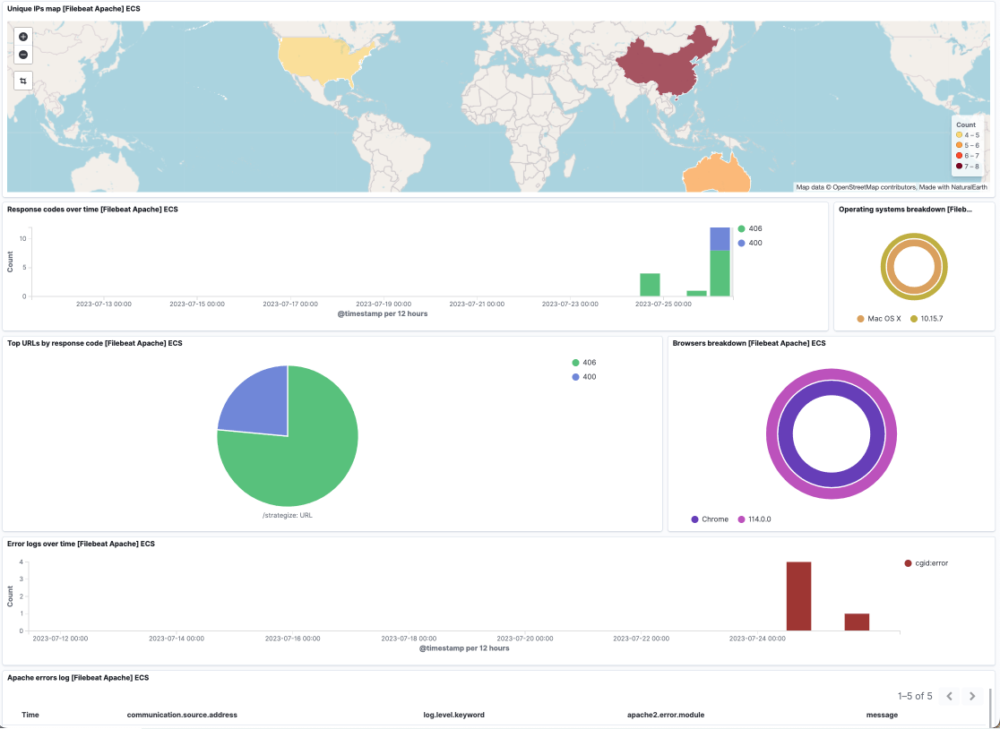

# Apache Integration

## What is Apache ?
Apache is an open source web server software for modern operating systems including UNIX and Windows.

See additional details [here](https://httpd.apache.org/).

## What is Apache Integration ?
An integration is a bundle of pre-canned assets which are bundled togather in a meaningful manner.

Apache integration includes dashboards, visualisations, queries and an index mapping.

## Ingestion Pipeline
To set up an ingestion pipeline, I used Docker to run Fluent-bit and an Apache fake log generator, along with an instance of OpenSearch. 

In `fluent-bit.conf`:
- The input is wherever your Apache logs are being ingested from. In my case, since I was using an Apache log generator, I used the `forward` protocol.
- Use the [filter from fluent-bit](https://github.com/fluent/fluent-bit/blob/master/conf/parsers.conf) for apache access logs.
- Optionally, I used a [GeoIP2 Filter](https://docs.fluentbit.io/manual/pipeline/filters/geoip2-filter) to enrich the data with geolocation data.
- Finally, I used a `otel-converter.lua` script to convert the parsed data into schema-compliant data
- I outputted the data to the port my OpenSearch instance was listening on.

### Dashboards
