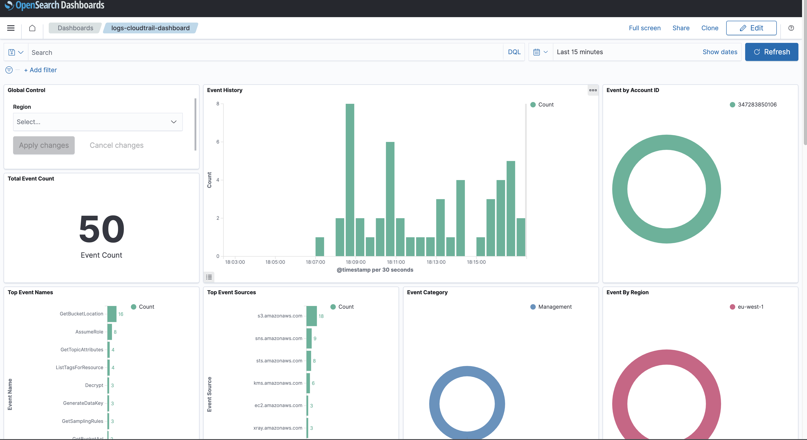

# AWS Config Log Integration

## What is AWS Config?

AWS Config is a service that helps you assess, audit, and evaluate the configurations of your AWS resources. It continuously monitors and records the changes made to your AWS resources and provides a detailed inventory of your resources' configuration settings. With AWS Config, you can track resource changes, troubleshoot configuration issues, and ensure compliance with your desired configurations and industry standards.

AWS Config can be used for various purposes, such as:

- Tracking configuration changes over time
- Ensuring compliance with security and governance policies
- Identifying resource misconfigurations and security vulnerabilities
- Auditing resource configurations against desired baselines

AWS Config enables you to view historical configuration details and changes, helping you maintain a reliable and secure AWS environment.

See additional details [here](https://aws.amazon.com/config/).

## What is AWS Config Log Integration?

An integration is a set of pre-configured assets bundled together to facilitate monitoring and analysis.

AWS Config log integration includes dashboards, visualizations, queries, and an index mapping.

### Dashboards

