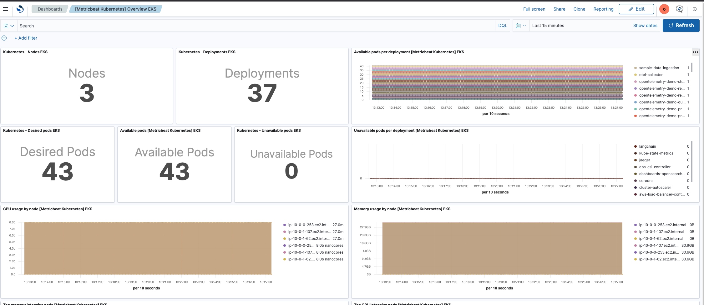

# Kubernetes Integration

## What is Kubernetes?

Kubernetes is an open-source container orchestration platform that automates the deployment, scaling, and management of containerized applications. It provides a robust and scalable infrastructure for running applications in a cloud-native environment.

See additional details [here](https://kubernetes.io/).

## What is Kubernetes Integration?

An integration is a collection of pre-configured assets that are bundled together to streamline monitoring and analysis.

Kubernetes integration includes dashboards, visualizations, queries, and an index mapping.

### Dashboards

With the Kubernetes integration, you can gain valuable insights into the health and performance of your containerized applications. The pre-configured dashboards and visualizations help you monitor key metrics, track resource utilization, and identify potential issues within your Kubernetes clusters. This integration empowers you to efficiently manage your containerized workloads, scale applications as needed, and ensure the reliability and availability of your Kubernetes environment.
