# Dashboard
OCSF & AES based security SIEM dashboards logs  using the following dashboards:

* [AWS Security Hub](#AWS-Security-Hub)
* [AWS WAF](#AWS-WAF)
* [AWS CloudHSM](#AWS-CloudHSM)
* [Amazon GuardDuty](#Amazon-GuardDuty)
* [AWS CloudTrail](#AWS-CloudTrail)
* [Amazon CloudFront](#Amazon-CloudFront)
* [AWS Client VPN](#AWS-Client-VPN)
* [Amazon VPC Flow Logs](#Amazon-VPC-Flow-Logs)
* [Amazon VPC Flow Logs Custom](#Amazon-VPC-Flow-Logs-Custom)
* [Elastic Load Balancing](#Elastic-Load-Balancing)
* [S3 Accesslog](#S3-Accesslog)
* [Amazon Relational Database Service (RDS)](#Amazon-RDS)
* [Amazon WorkSpaces](#Amazon-WorkSpaces)
* [Amazon OpenSearch Service Metrics](#Amazon-OpenSearch-Service-Metrics)

## AWS Security Hub

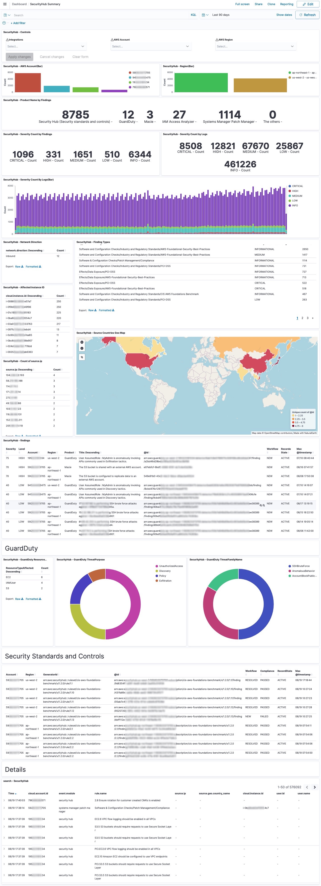

## AWS WAF

This dashboard was imported from [AWS WAF Dashboard](https://github.com/aws-samples/aws-waf-dashboard) and then was customized

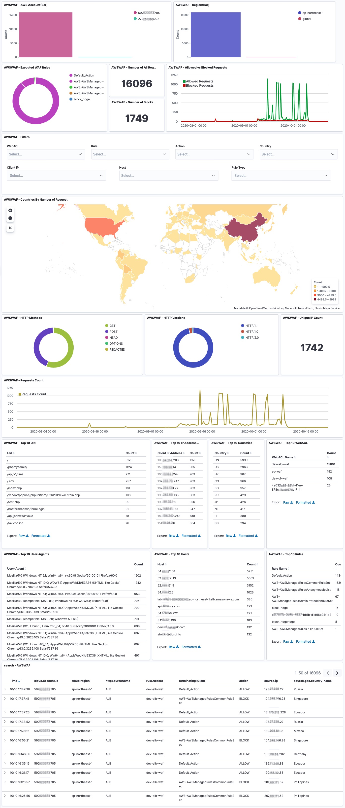

## AWS CloudHSM

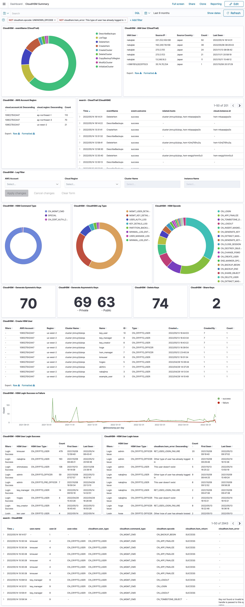

## Amazon GuardDuty

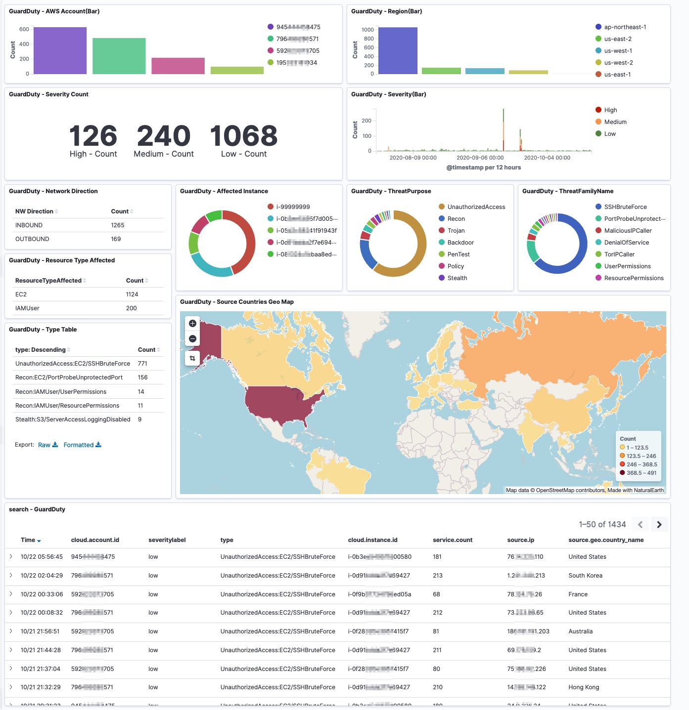

## AWS CloudTrail

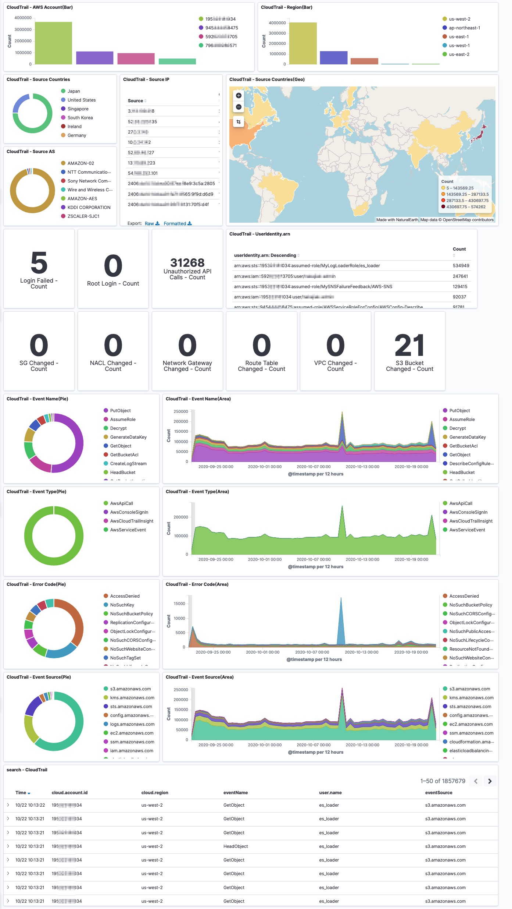

## Amazon CloudFront

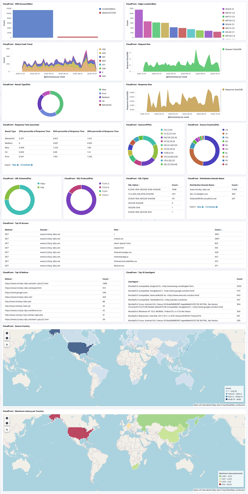

## AWS Client VPN

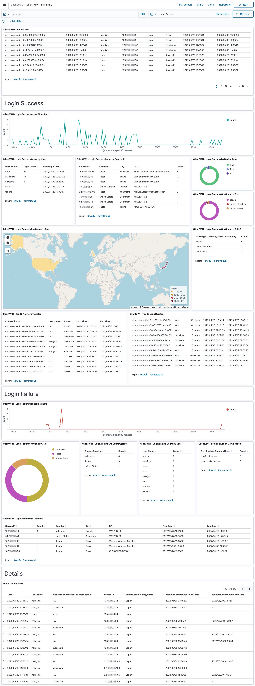

## Amazon VPC Flow Logs

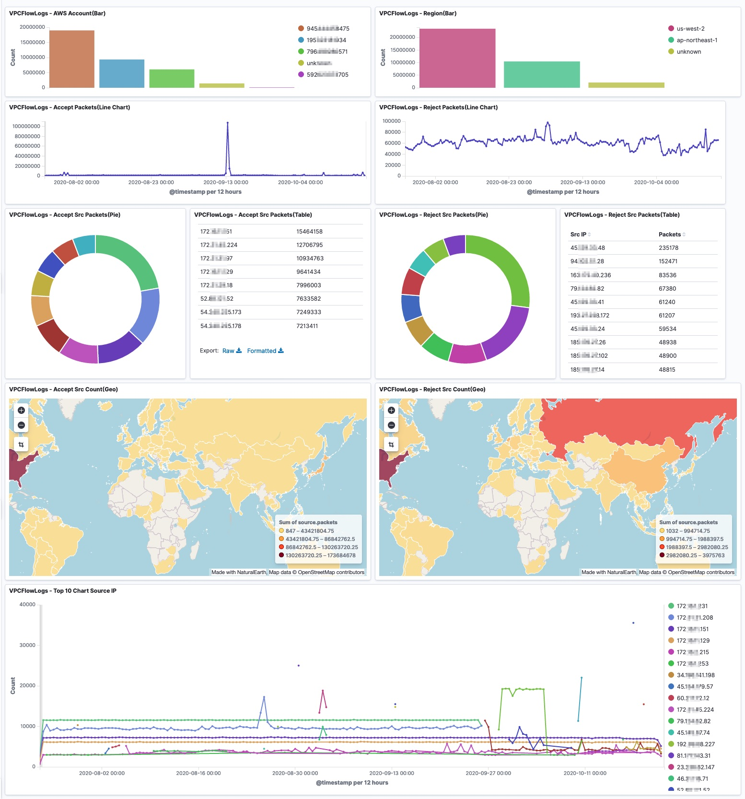

## Amazon VPC Flow Logs Custom

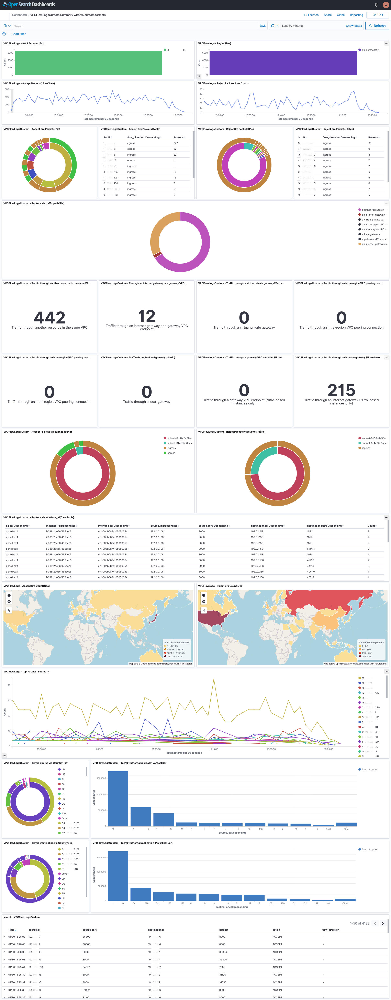

## Elastic Load Balancing

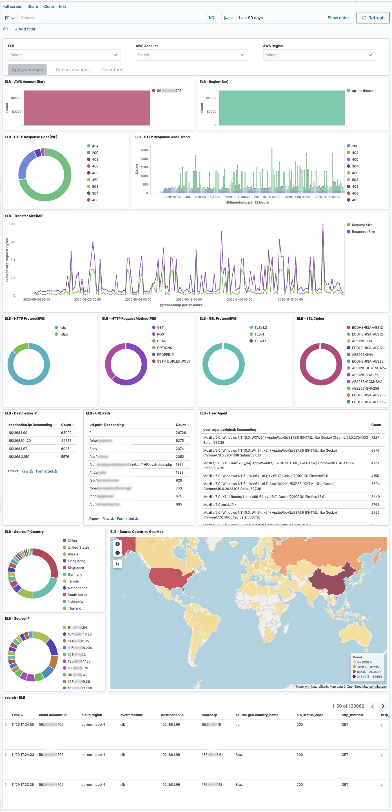

## S3 Accesslog

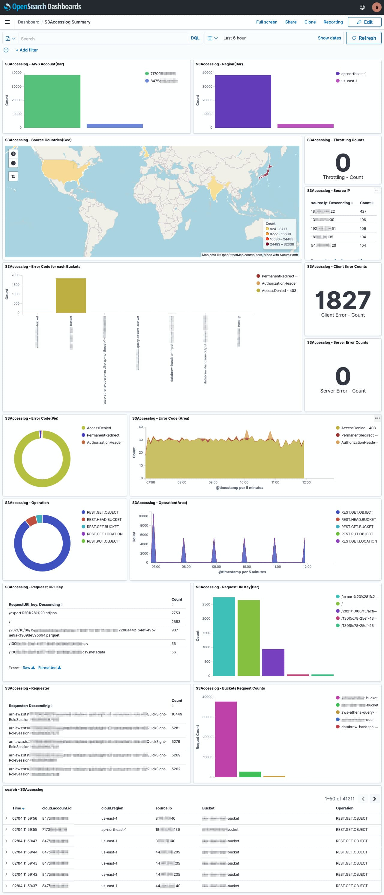

## Amazon RDS

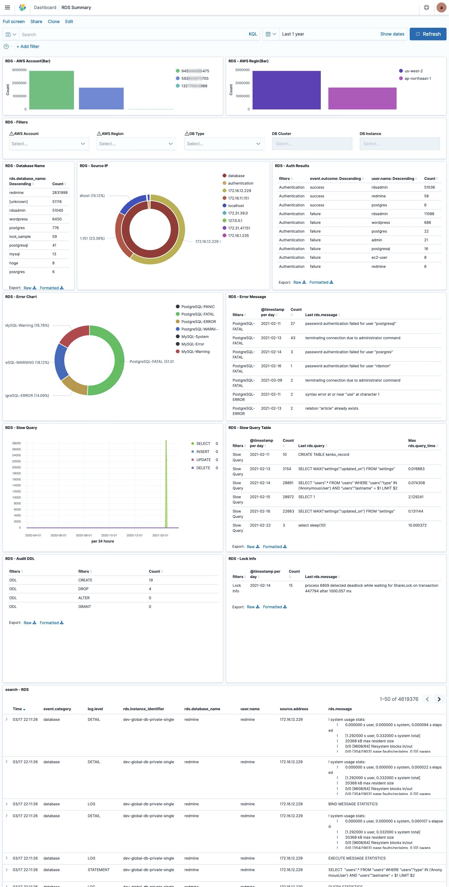

## Amazon WorkSpaces

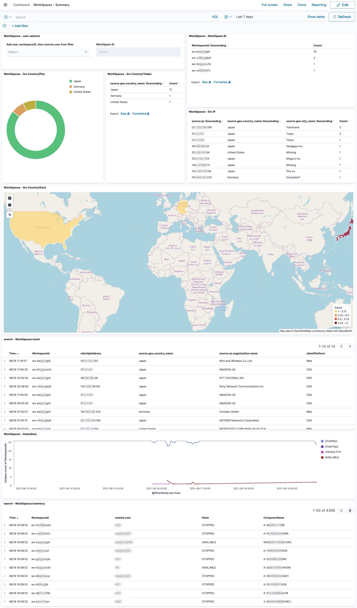

## Amazon OpenSearch Service Metrics

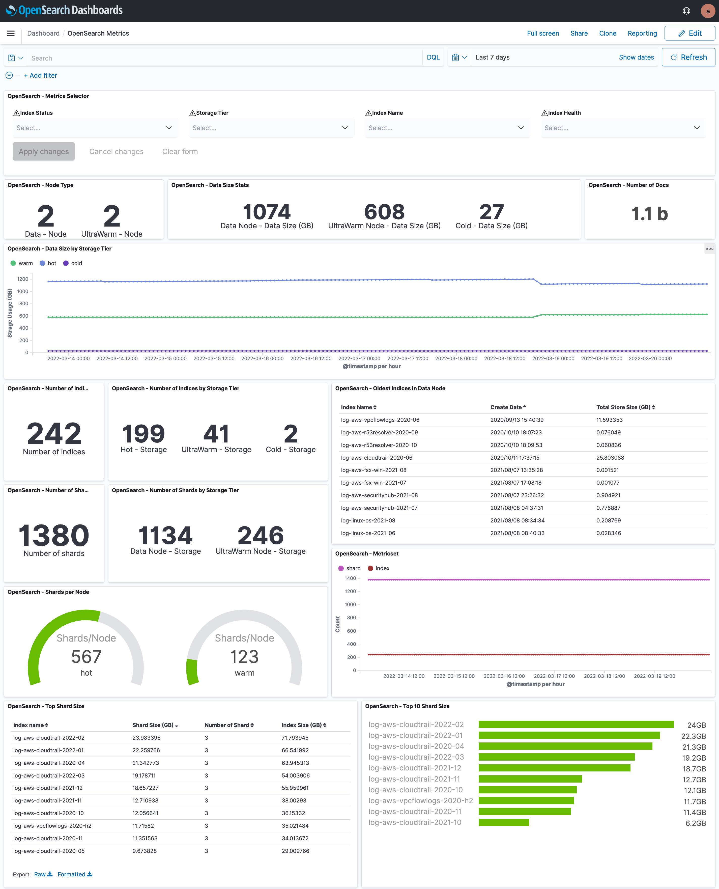

