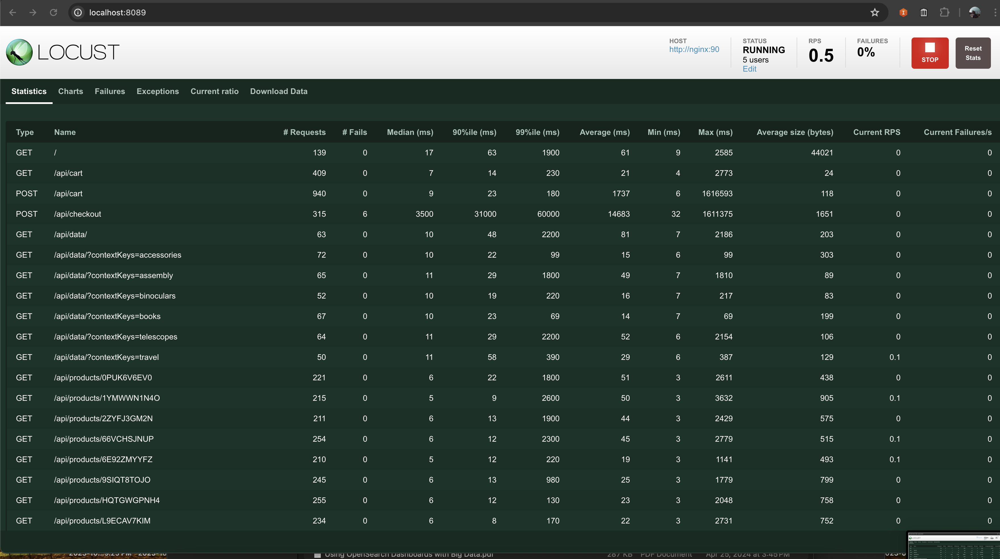
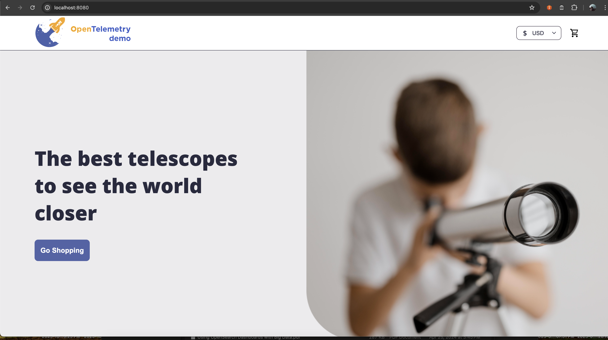

# Getting Started
Getting started with the OTEL demo including running the OpenSearch Server and Dashboard.

`docker-compose up -d` starts all the services and initiates the load-generator activity for synthetically creating user activity on the demo web store.

The following web-pages can be directly access to review the load generator
 - http://localhost:8089/

The following web-pages can be directly access to actually simulate store purchase
- http://localhost:8080/ (front-end) OR  http://localhost:90 (nginx-forntend proxy) 

---

## Logging In Dashboard

Once all services are up and running - log-in to the Dashboard and enter the next credentials

**User: `admin`  | Password:  `my_%New%_passW0rd!@#`** 

- http://localhost:5601/

## Store URLs in session storage
Enable Store URLs in session storage for allowing to view and edit Vega based visualizations 

## Loading the OTEL Schema Manually
During this phase the index-templates for the OTEL entities is generated  

## Installing OTEL Services Demo 

Once logged in - navigate to the Integration sections and select the OTEL-Demo Integration

- Select the OTEL-Demo Integration

- Run the set-up integration and choose the `otel-*` index name as the integration data source

 - View all the Generated Dashboards:

## Ingestion Rate Dashboard
This dashboard show the 3 signals ingestion rate as they are shipped via data-prepper into OpenSearch indices

## Services High Level Dashboards View
This dashboard show the 3 signals ingestion rate as they are shipped via data-prepper into OpenSearch indices

## Single Service Details Dashboards View
This dashboard show the specific service details including associated high level view of the metrics collected for the service 

## Service Metrics View

### Service Metrics system projection Dashboards 
This dashboard show the specific service details in particular the system related metrics collected for the service

### Service Metrics network projection Dashboards 
This dashboard show the specific service details in particular the network related metrics collected for the service

## Metrics Analytics

### Setting Up Prometheus `datasource`
...

### Query Prometheus OTEL metrics
...

### Query OpenSearch OTEL metrics
...

## Discover - Log Exploration
...
